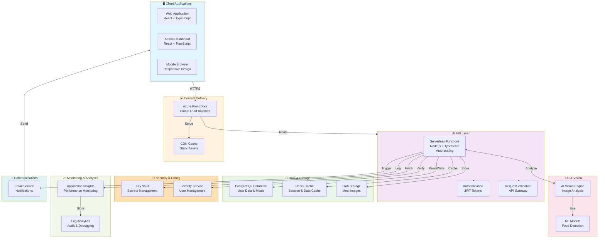

# System Architecture Overview

High-level architecture diagram for investors - showing the complete system infrastructure.

## Architecture Diagram

## Component Breakdown

### Client Applications
- **Web Application**: Main React-based web interface for users
- **Admin Dashboard**: Administrative portal for managing diet profiles and system configuration
- **Mobile Browser**: Responsive design supporting all mobile devices

### Content Delivery Network
- **Azure Front Door**: Global load balancer and DDoS protection
- **CDN Cache**: Accelerated static asset delivery (CSS, JS, images)

### API Layer
- **Serverless Functions**: Scalable backend processing with Node.js runtime
- **Authentication**: JWT-based token validation
- **Request Validation**: Input sanitization and API contract enforcement

### AI & Vision
- **AI Vision Engine**: Advanced image analysis and food recognition
- **ML Models**: Pre-trained models for food detection and protein estimation

### Data & Storage
- **PostgreSQL Database**: Primary data store for users, meals, and macros
- **Redis Cache**: Session management and frequently accessed data
- **Blob Storage**: Secure image storage with retention policies

### Security & Configuration
- **Key Vault**: Centralized secrets management (API keys, connection strings)
- **Identity Service**: User authentication and authorization

### Monitoring & Analytics
- **Application Insights**: Real-time performance metrics and error tracking
- **Log Analytics**: Centralized logging for troubleshooting and auditing

### Communications
- **Email Service**: Transactional emails and notifications

## Data Flow

1. **User Upload**: Client sends meal image through secure HTTPS to Front Door
2. **Processing**: Function receives request, validates JWT token, retrieves secrets from Key Vault
3. **Analysis**: Image is sent to AI Vision engine for analysis
4. **Storage**: Meal data saved to PostgreSQL, image to Blob Storage
5. **Response**: Results returned to client with macro breakdown
6. **Caching**: Frequently accessed data cached in Redis
7. **Monitoring**: All operations logged to Application Insights

## Scalability Features

- **Auto-scaling Functions**: Automatically scales based on demand
- **Database Replication**: PostgreSQL with backup and failover
- **Global CDN**: Content served from nearest edge location
- **Load Balancing**: Azure Front Door handles traffic distribution
- **Cache Layer**: Redis reduces database load

## Security Features

- **End-to-End Encryption**: HTTPS for all communications
- **Secret Management**: Centralized Key Vault for sensitive data
- **Token-Based Auth**: JWT validation on every request
- **DDoS Protection**: Azure Front Door provides protection
- **Database Encryption**: At-rest and in-transit encryption
- **Access Control**: RBAC for resources and services

## Deployment

- **Infrastructure as Code**: Bicep templates for reproducible infrastructure
- **CI/CD Pipeline**: Automated build, test, and deployment
- **Multi-Stage**: Separate environments for dev, staging, and production
- **Rollback Support**: Version control for infrastructure and code
