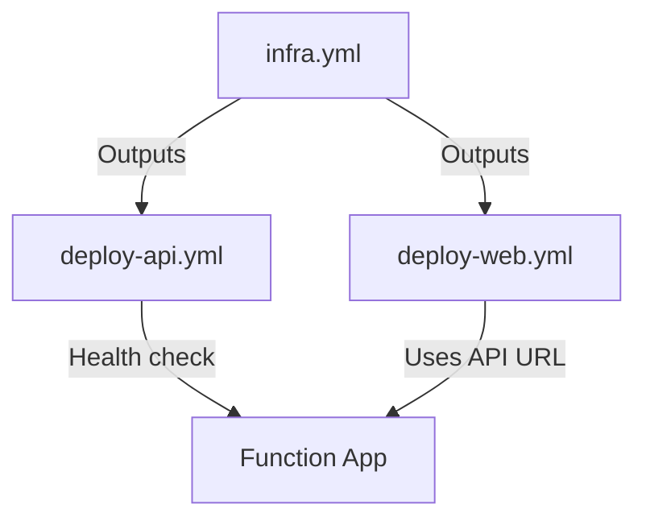

# GitHub Actions Workflow Contracts

**Purpose**: Defines the expected structure, inputs, outputs, and behavior of GitHub Actions workflows

## 1. Infrastructure Deployment Workflow

**File**: `.github/workflows/infra.yml`

### Trigger Contract

```yaml
on:
  workflow_dispatch:  # Manual trigger only
    inputs:
      environment:
        description: 'Target environment'
        required: true
        type: choice
        options:
          - prod
          - staging
          - dev
      confirm_deploy:
        description: 'Type "DEPLOY" to confirm'
        required: true
        type: string
```

### Inputs

| Input | Type | Required | Description | Valid Values |
|-------|------|----------|-------------|--------------|
| `environment` | Choice | Yes | Target Azure environment | "prod", "staging", "dev" |
| `confirm_deploy` | String | Yes | Confirmation string | Must be "DEPLOY" exactly |

### Outputs

| Output | Type | Description | Example |
|--------|------|-------------|---------|
| `resourceGroupName` | String | Created resource group name | `proteinlens-rg-prod` |
| `functionAppName` | String | Function App name | `proteinlens-api-prod` |
| `functionAppUrl` | String | Function App HTTPS endpoint | `https://proteinlens-api-prod.azurewebsites.net` |
| `staticWebAppName` | String | Static Web App name | `proteinlens-web-prod` |
| `staticWebAppUrl` | String | Static Web App URL | `https://happy-sea-123abc.azurestaticapps.net` |
| `postgresServerName` | String | PostgreSQL server name | `proteinlens-pg-prod.postgres.database.azure.com` |
| `keyVaultName` | String | Key Vault name | `proteinlens-kv-prod` |
| `storageAccountName` | String | Storage Account name | `proteinlensstorageprod` |

### Exit Codes

| Code | Meaning | Action |
|------|---------|--------|
| 0 | Success | All resources deployed successfully |
| 1 | Validation failed | Bicep validation errors, fix templates |
| 2 | Deployment failed | Azure deployment errors, check logs |
| 3 | Confirmation not provided | User did not type "DEPLOY" |

### Required Secrets

- `AZURE_CREDENTIALS`: Azure service principal JSON
- `AZURE_SUBSCRIPTION_ID`: Subscription ID
- `AZURE_RESOURCE_GROUP`: Resource group name

---

## 2. Backend Deployment Workflow

**File**: `.github/workflows/deploy-api.yml`

### Trigger Contract

```yaml
on:
  push:
    branches: [main]
    paths:
      - 'backend/**'
      - 'infra/modules/function-app.bicep'
      - '.github/workflows/deploy-api.yml'
  workflow_dispatch:  # Allow manual trigger
```

### Inputs

| Input | Type | Required | Description | Default |
|-------|------|----------|-------------|---------|
| (none) | - | - | Workflow uses branch and paths | - |

### Outputs

| Output | Type | Description | Example |
|--------|------|-------------|---------|
| `deployment_status` | String | Deployment result | "success" | "failed" |
| `function_app_url` | String | Deployed Function App URL | `https://proteinlens-api-prod.azurewebsites.net` |
| `build_version` | String | Git commit SHA | `abc123def456` |
| `migration_status` | String | Prisma migration result | "applied" | "failed" | "no-pending" |

### Exit Codes

| Code | Meaning | Action |
|------|---------|--------|
| 0 | Success | Backend deployed and healthy |
| 1 | Build failed | TypeScript compilation errors, fix code |
| 2 | Migration failed | Prisma migration errors, check database |
| 3 | Deployment failed | Azure Functions deployment failed |
| 4 | Health check failed | Endpoint returned non-200, check logs |

### Required Secrets

- `AZURE_CREDENTIALS`: Azure service principal JSON
- `AZURE_FUNCTION_APP_NAME`: Function App name (output from infra workflow)

### Job Steps

1. **Checkout code**: Clone repository
2. **Setup Node.js 20**: Install Node runtime
3. **Install dependencies**: `npm ci --prefix backend`
4. **Build backend**: `npm run build --prefix backend`
5. **Run Prisma migrations**: `npx prisma migrate deploy` (via Function App cold start)
6. **Deploy to Azure Functions**: `azure/functions-action@v1`
7. **Health check**: `curl -f $FUNCTION_APP_URL/api/health`
8. **Report status**: GitHub Actions summary

---

## 3. Frontend Deployment Workflow

**File**: `.github/workflows/deploy-web.yml`

### Trigger Contract

```yaml
on:
  push:
    branches: [main]
    paths:
      - 'frontend/**'
      - 'infra/modules/static-web-app.bicep'
      - '.github/workflows/deploy-web.yml'
  workflow_dispatch:
```

### Inputs

| Input | Type | Required | Description | Default |
|-------|------|----------|-------------|---------|
| `api_url` | String | No | Override API base URL | From environment |

### Outputs

| Output | Type | Description | Example |
|--------|------|-------------|---------|
| `deployment_status` | String | Deployment result | "success" | "failed" |
| `app_url` | String | Deployed Static Web App URL | `https://happy-sea-123abc.azurestaticapps.net` |
| `build_version` | String | Git commit SHA | `abc123def456` |
| `build_size_kb` | Number | Bundle size in KB | 268 |

### Exit Codes

| Code | Meaning | Action |
|------|---------|--------|
| 0 | Success | Frontend deployed successfully |
| 1 | Build failed | TypeScript/Vite build errors, fix code |
| 2 | Deployment failed | Static Web Apps upload failed |

### Required Secrets

- `AZURE_STATIC_WEB_APPS_API_TOKEN`: Deployment token from infrastructure output

### Environment Variables

| Variable | Required | Description | Example |
|----------|----------|-------------|---------|
| `VITE_API_URL` | Yes | Backend API base URL | `https://proteinlens-api-prod.azurewebsites.net` |

### Job Steps

1. **Checkout code**: Clone repository
2. **Setup Node.js 20**: Install Node runtime
3. **Install dependencies**: `npm ci --prefix frontend`
4. **Build frontend**: `VITE_API_URL=$API_URL npm run build --prefix frontend`
5. **Deploy to Static Web Apps**: `azure/static-web-apps-deploy@v1`
6. **Report status**: GitHub Actions summary with build stats

---

## Workflow Relationships



**Sequence**:
1. **First time**: Run `infra.yml` manually to create resources
2. **Subsequent deployments**: Push to `main` triggers `deploy-api.yml` and/or `deploy-web.yml` based on changed paths
3. **Resource updates**: Manually run `infra.yml` when infrastructure changes needed

## Common Failure Scenarios

| Scenario | Workflow | Error | Resolution |
|----------|----------|-------|------------|
| Missing GitHub Secret | All | Authentication failed | Add missing secret in GitHub Settings |
| Bicep validation failed | infra.yml | Template syntax error | Fix Bicep template, re-run |
| PostgreSQL migration failed | deploy-api.yml | Migration timeout | Check database connectivity, re-run |
| TypeScript build error | deploy-api.yml, deploy-web.yml | Compilation failed | Fix TypeScript errors, push fix |
| Health check timeout | deploy-api.yml | HTTP 503 | Check Function App logs, verify Key Vault access |
| Static Web App token expired | deploy-web.yml | Upload failed | Regenerate token from Azure Portal, update GitHub Secret |

## Workflow Execution Time SLAs

| Workflow | Target Time | Timeout |
|----------|-------------|---------|
| infra.yml | <15 min (first run), <5 min (updates) | 30 min |
| deploy-api.yml | <3 min | 10 min |
| deploy-web.yml | <5 min | 10 min |

## Notifications

All workflows send notifications on:
- **Success**: GitHub Actions status check (green check)
- **Failure**: GitHub Actions status check (red X) + workflow run summary with error details
- **Manual trigger**: GitHub UI shows workflow dispatch event

## Idempotency

- **infra.yml**: Idempotent (Bicep incremental mode, safe to re-run)
- **deploy-api.yml**: Idempotent (overwrites deployment, migrations are idempotent)
- **deploy-web.yml**: Idempotent (overwrites static assets)
